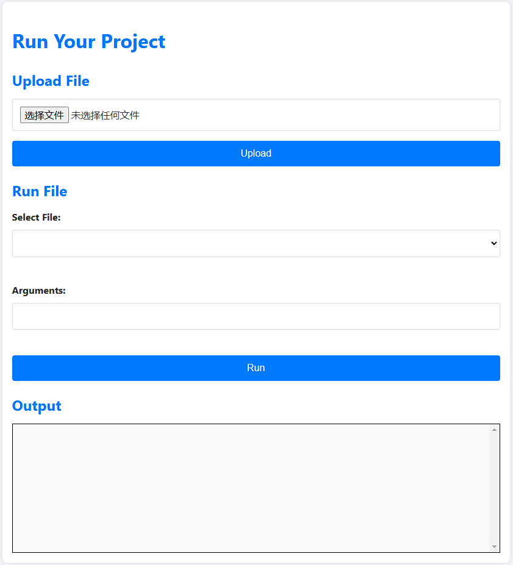

# OneTimeEnv

本 Docker 镜像提供了一种简便的方式来运行 Flask 应用，该应用允许上传、解压和执行 Python 脚本及其依赖项。

## 功能特性

*   上传 `.zip`, `.tar`, `.tar.gz` 或 `.tgz` 格式的压缩包，其中包含 Python 脚本。
*   自动解压上传的压缩包。
*   使用 `pip` 和 `requirements.txt` 文件安装依赖项。
*   通过 Web 界面执行 Python 脚本。
*   通过 Web Socket 连接进行实时输出日志记录。

## 前提条件

*   您的系统上已安装 Docker。

## 预览


## 使用方法

### 1. 构建 Docker 镜像

克隆包含 `Dockerfile`, `app.py`, `deploy.sh`, `static/` 和 `templates/` 文件的代码仓库。 然后，使用以下命令构建 Docker 镜像：

```bash
docker build -t onetimenv .
```

### 2. 运行 Docker 容器

运行 Docker 容器，将主机上的 8000 端口映射到容器上的 8000 端口：

```bash
docker run -p 8000:8000 onetimenv
```

### 3. 访问 Web 界面

打开您的 Web 浏览器，并访问 `http://localhost:8000`。

### 4. 上传您的项目

1.  单击 "选择文件" 按钮，选择您的项目压缩包 (`.zip`, `.tar`, `.tar.gz` 或 `.tgz`)。
2.  单击 "上传" 按钮。
3.  应用程序会将压缩包解压到 `/app/uploads/<项目名称>` 目录。

### 5. 运行您的脚本

1.  从下拉列表中选择您想要运行的 Python 脚本。
2.  在 "参数" 字段中输入任何命令行参数。
3.  单击 "运行" 按钮。
4.  脚本的输出将显示在 "输出" 部分。

## `Dockerfile` 详细说明

`Dockerfile` 执行以下操作：

*   使用 `python:3.11-bookworm` 作为基础镜像。
*   安装必要的工具：`nodejs`, `npm`, `zip`, `tar`, `gosu` 和 `build-essential`。
*   创建一个非 root 用户 `myuser`。
*   将工作目录设置为 `/app`。
*   复制应用程序文件 (`app.py`, `deploy.sh`, `static/`, `templates/`)。
*   安装 Python 依赖项：`flask` 和 `flask-socketio`。
*   将 `/app/uploads` 目录的所有者设置为 `myuser`。
*   切换到 `myuser` 用户。
*   暴露 8000 端口。
*   执行 `deploy.sh` 脚本。

### 环境变量

*   **无** - 当前镜像未使用任何环境变量。您可以根据需要添加环境变量，例如配置数据库连接或 API 密钥。

## `deploy.sh` 详细说明

`deploy.sh` 脚本执行以下操作：

*   创建项目目录 `/app/www/html` 和上传目录 `/app/uploads`
*   将静态文件和模板复制到项目目录
*   启动 Flask 应用程序

## 贡献

欢迎贡献代码！ 请提交包含您的更改的 Pull Request。

## 许可证

This project is licensed under the MIT License - see the [LICENSE](LICENSE) file for details.

## 故障排除

*   **依赖项安装失败：** 如果依赖项安装失败，请检查 `requirements.txt` 文件是否正确，并且您的容器可以访问外部网络。
*   **脚本执行错误：** 如果脚本执行出错，请检查脚本的语法和逻辑，并确保已安装所有必要的依赖项。

## 已知问题

*   **无** - 目前没有已知问题。

## 联系方式

如果您有任何问题或建议，请在 GitHub 上提交 Issue。

## 维护者

*   zaixia108

## 创建日期

*   2025-02-07

## 版本

*   1.0
